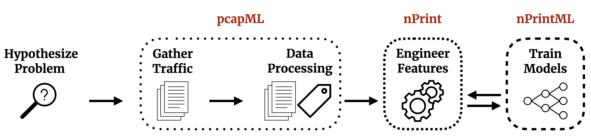

<!-- # The nPrint Project -->

The nPrint project is a collection of open source software and benchmarks for network traffic analysis that aim to replace the built-to-task approach currently taken when examining traffic analysis tasks.

- `nprint` provides a generic representation for machine learning based network traffic analysis
- `nprintml` combines nPrint and automated machine learning techniques for fully automated traffic analysis pipelines
- `pcapml` standardizes traffic analysis tasks at the dataset level by encoding metadata directly into raw traffic captures
- `pcapml_fe` provides a standard, easy to use interface for metadata-encoded traffic captures
- `pcapML Benchmarks` leverage the standardization provided by `pcapML` to enable quick, comparable benchmarking of any traffic analysis task
