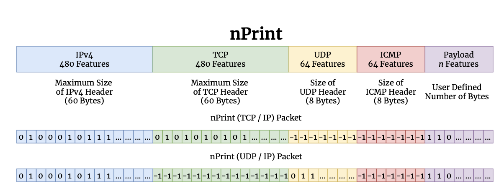

# nPrint

nPrint is a standard data representation for network traffic created to be directly usable with machine learning algorithms, replacing feature engineering for a wide array of traffic analysis problems. The original nPrint paper can be found [here](https://arxiv.org/pdf/2008.02695.pdf)



## Implemented Protocols

nPrint currently supports the following protocols, but is easily extendable and we encourage users to add to this list!

* IPv4
* IPv6 (Fixed Header)
* TCP
* UDP
* ICMP
* Payloads 
 

## Citing nPrint
```
@inproceedings{10.1145/3460120.3484758,
author = {Holland, Jordan and Schmitt, Paul and Feamster, Nick and Mittal, Prateek},
title = {New Directions in Automated Traffic Analysis},
year = {2021},
isbn = {9781450384544},
publisher = {Association for Computing Machinery},
address = {New York, NY, USA},
url = {https://doi.org/10.1145/3460120.3484758},
doi = {10.1145/3460120.3484758},
pages = {3366–3383},
numpages = {18},
keywords = {machine learning on network traffic, automated traffic analysis, network traffic analysis},
location = {Virtual Event, Republic of Korea},
series = {CCS '21}
}
```


