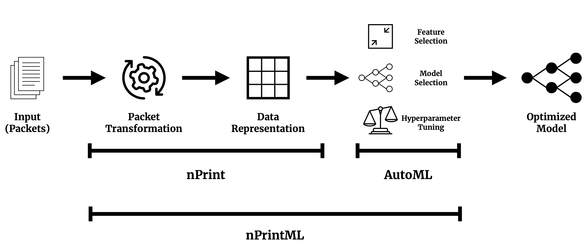

# nPrintML

nprintML bridges the gap between nPrint, which generates standard fingerprints for packets, and AutoML, which allows for optimized model training and traffic analysis. nprintML enables users with network traffic and labels to perform optimized packet-level traffic analysis without writing any code.

