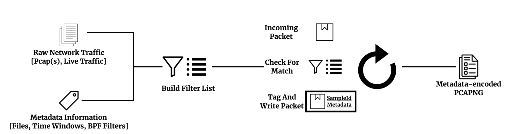

# pcapml

pcapML is a system for improving the reproducability of traffic analysis tasks. pcapML leverages the `pcapng` file format to encode metadata *directly* into raw traffic captures, removing any ambiguity about which packets belong to any given traffic flow, application, attack, etc., while still being compatiable with popular tools such as `tshark` and `tcpdump`. 

For dataset curators, pcapML provides an easy way to encode metadata into raw traffic captures, ensuring the dataset is used in a consistent manner. On the analysis side, pcapML provides a standard dataset format for users to work with across different datasets.

